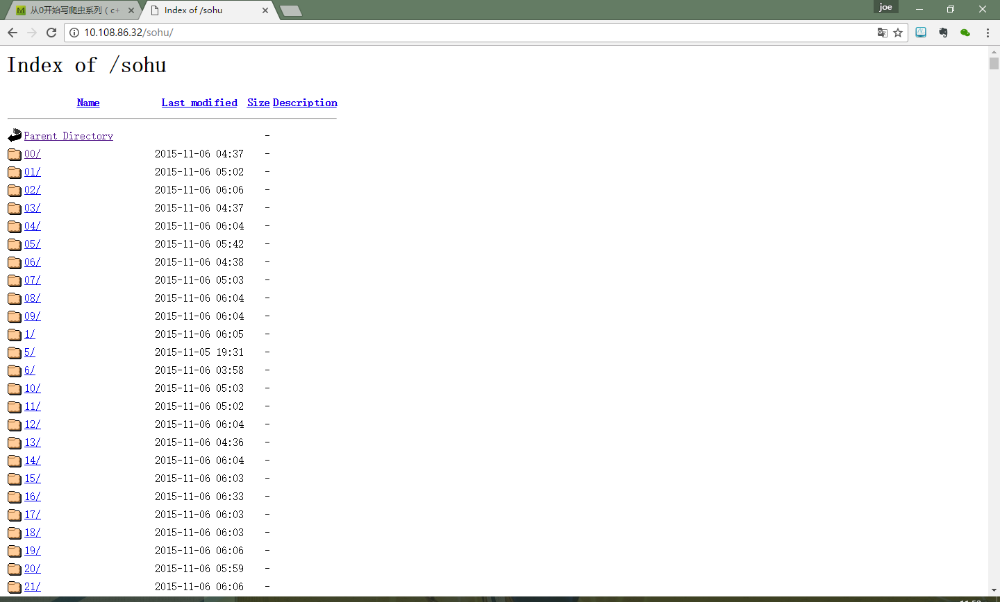
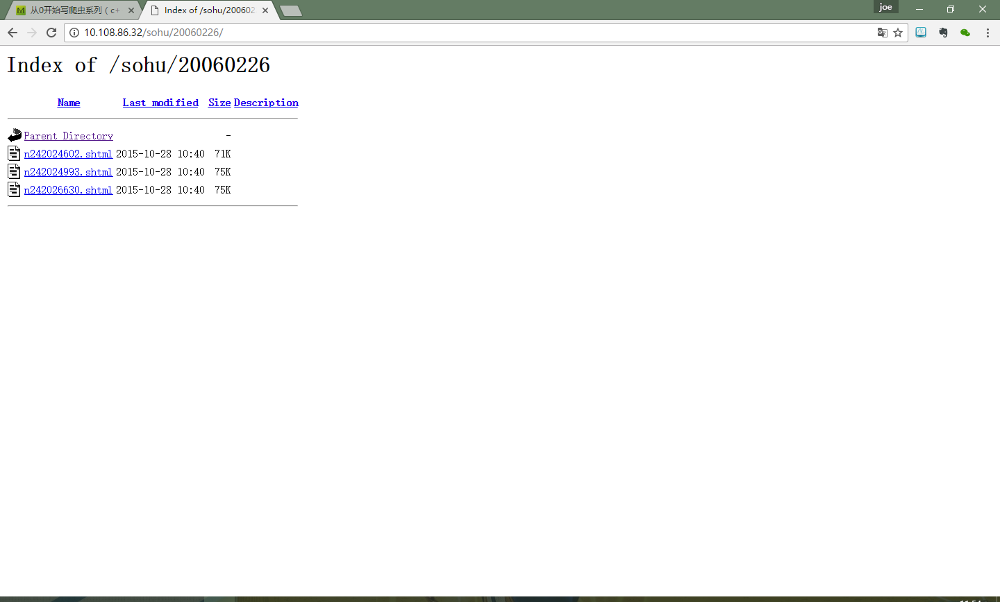
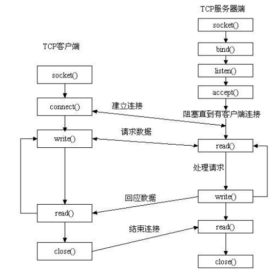

#从0开始写爬虫系列（c++）

@(c++成神之路)

[toc]

##总体框架分析
###完成目标
爬取如下的页面信息（每个文件夹都有子文件夹，最终会有html文件可供下载）
	

所以这里就会涉及到一个获取url的过程，下面我会慢慢讲解。

###第一步-----完成一个简单的阻塞I/O的能够下载网页的爬虫demo
####分析
*  能够利用socket进行连接，下载
*  有一个正则提取url的函数
*  有一个放url的队列（其实我这里设置了两个，一个放最终的html，一个放中间的目录路径）
*  有一个函数不断的从队列里找url并分析
*  有一个函数不断的从队列里找html下载

以上就是这个第一步的简单爬虫应该做的事情，下面我们开始实现。

####关键结构体
这部分可以暂时略过，只是为了文档的详细才把这些放上来的。

	sockaddr_in（在netinet/in.h中定义）：
	struct sockaddr_in {
		short int sin_family;           /* Address family */
		unsigned short int sin_port;    /* Port number */
		struct in_addr sin_addr;        /* Internet address */
		unsigned char sin_zero[8];      /* Same size as struct sockaddr */
	};
	struct in_addr {
		unsigned long s_addr;
	};
	typedef struct in_addr {
	union {
		struct{
			unsigned char s_b1,
	        s_b2,
	        s_b3,
	        s_b4;
	    }S_un_b;
	    struct {
	        unsigned short s_w1,
	        s_w2;
	    } S_un_w;
	    unsigned long S_addr;
	} S_un;
	} IN_ADDR;
	sin_family指代协议族，在socket编程中只能是AF_INET

	下面是部分以上的字段讲解：（大概理解一下对后面的思考有很大帮助）
	
	sin_port存储端口号（使用网络字节顺序）
	sin_addr存储IP地址，使用in_addr这个数据结构
	sin_zero是为了让sockaddr与sockaddr_in两个数据结构保持大小相同而保留的空字节。
	s_addr按照网络字节顺序存储IP地址
	sockaddr_in和sockaddr是并列的结构，指向sockaddr_in的结构体的指针也可以指向
	sockadd的结构体，并代替它。也就是说，你可以使用sockaddr_in建立你所需要的信息,
	在最后用进行类型转换就可以了bzero((char*)&mysock,sizeof(mysock));//初始化
	mysock结构体名
	mysock.sa_family=AF_INET;
	mysock.sin_addr.s_addr=inet_addr("192.168.0.1");
	……
	等到要做转换的时候用：
	（struct sockaddr*）mysock

	struct URL {
	    char host[64];
	    string url;//除去域名后的url
	};
	自定义的URL结构体，方便后面函数的使用。

	queue<struct URL> qurl;
	queue<struct URL> qready;
	两个队列。
	
####创建socket
int createSocket(char *hostname,int port);

	int createSocket(char *hostname,int port) {
	    struct sockaddr_in servAddr;
	    struct hostent * host;
	    int sockfd;
	    host = gethostbyname(hostname);
	    if(host == NULL) {
	        perror("dns 解析失败");
	    }
	    servAddr.sin_family = AF_INET;
	    servAddr.sin_addr = *((struct in_addr *)host->h_addr);
	    servAddr.sin_port = htons(port);
	    bzero(&(servAddr.sin_zero),8);
	
	    sockfd = socket(AF_INET,SOCK_STREAM,0);
	    if(sockfd == -1) {
	        perror("socket 创建失败");
	    }
	
	    if(connect(sockfd,(struct sockaddr *)&servAddr,sizeof(struct sockaddr_in)) == -1) {
	        perror("connect 失败");
	    }
	    return sockfd;
	}

####发送http请求
int sendHttpRequest(int sockfd,struct URL url);

	int sendHttpRequest(int sockfd,struct URL url) {
	    char sendBuf[BUF_SIZE];
	    int sendSize;
	    //构建一个http请求
	    sprintf(sendBuf,"GET %s HTTP/1.1 \r\nHost: %s \r\nConnection: Close \r\n\r\n",url.url.c_str(),url.host);
	    if((sendSize = send(sockfd,sendBuf,BUF_SIZE,0)) == -1) {
	        perror("send 失败");
	    }
	    return 0;
	}
####等待接收http请求
这个需要分成两个函数，因为我们有两种url，一种是目录路径的，就像(http://10.108.86.32/sohu/01/)，而另一种是直接的html文件，在接收的同时可以保存到文件。所以。

1. int recvHttpRespond(int sockfd,char *ch);
2. int recvHttpRespond2(int sockfd,char *ch,string filename;

		int recvHttpRespond(int sockfd,char *ch) {
		    char recvBuf[BUF_SIZE];
		    int recvSize;
		    //获取http应答信息
		    memset(recvBuf,0,sizeof(recvBuf));
		    memset(ch,0,sizeof(ch));
		    int count = 0;
		    cout<<"start receiving...\n";
		    while(recvSize = recv(sockfd,recvBuf,BUF_SIZE,0)>0) {
		        count++;
		        strcat(ch,recvBuf);
		        memset(recvBuf,0,sizeof(recvBuf));
		    }
		    return 0;
		}
		

		int recvHttpRespond2(int sockfd,char *ch,string filename) {
		    char recvBuf[BUF_SIZE];
		    int recvSize;
		    //获取http应答信息
		    memset(recvBuf,0,sizeof(recvBuf));
		    memset(ch,0,sizeof(ch));
		    int count = 0;
		    cout<<"start receiving...\n";
		    while(recvSize = recv(sockfd,recvBuf,BUF_SIZE,0)>0) {
		        count++;
		        strcat(ch,recvBuf);
		        memset(recvBuf,0,sizeof(recvBuf));
		    }
		    char start[] = {"<!DOCTYPE"},*pt;
		    if(pt = strstr(ch,start)) {
		        ch = pt;
		    }
		    saveToFile(ch,filename,count*BUF_SIZE);
		    return 0;
		}

recvHttpRespond2中有个小小的处理，存到文件中的html内容会包含我并不想要的header内容，我不知道高效的方法是怎么处理的，我用的是找子串起始位置的方式，代码如下：

	char start[] = {"<!DOCTYPE",*pt};
	if(pt = strstr(ch,start)) {
		ch = pt;
	}

到此为止，基本的网络连接的工具函数我们都写好了，接下来就是如何去写一个正则匹配的问题了。

####正则匹配
int reptile_regex(string buf,char* pattern,int type,string url_prefix);

	int reptile_regex(string buf,char* pattern,int type,string url_prefix) {
	    regex img_regex(pattern);
	    string splash = "/";
	
	    // 使用类 regex_iterator 来进行多次搜索.
	    cout << " =  =  =  =  =  =  =  =  =  =  =  =  =  =  =  =  =  =  =  =  =  =  =  =  =  =  =  = " << endl;
	    auto words_begin = 
	        sregex_iterator(buf.begin(), buf.end(), img_regex);
	    auto words_end = sregex_iterator();
	    if (type == 1) {
	        for (sregex_iterator i = words_begin; i != words_end; ++i) {
	            smatch match = *i;                                                 
	            string match_str = match.str();
	            match_str = match_str.substr(2,match_str.size()-1);
	            //cout<<match_str<<endl;
	            struct URL url;  
	            strcpy(url.host,"10.108.86.32");
	            string tmp = url_prefix + splash + match_str;
	            url.url = tmp;
	            //cout<<url.host<<url.url<<endl;
	            qready.push(url);
	        }
	    }
	    else {
	        for (sregex_iterator i = words_begin; i != words_end; ++i) {
	            smatch match = *i;                                                 
	            string match_str = match.str();
	            match_str = match_str.substr(6,match_str.size()-1);
	            //cout<<match_str<<endl;
	            struct URL url;  
	            strcpy(url.host,"10.108.86.32");
	            string tmp = url_prefix + splash + match_str;
	            url.url = tmp;
	            //cout<<url.host<<url.url<<endl;
	            qurl.push(url);
	        }
	    }
	    return 0;
	}
我将其分成了两个部分，用于区分两种不同的url（之前提到过了），最终都要加入到不同的队列中去。

####主函数

	int put_in_queue(char* str,char* str2) {
	    int sockfd;
	    char ch[1000000];
	    char pattern_url[128] = {0};
	    struct URL url;
	    string url_prefix = "/sohu";
	    strcpy(url.host,"10.108.86.32");
	    url.url = "/sohu/";
	    cout<<"looking into:\n";
	    cout<<url.host<<url.url<<endl;
	    sockfd = createSocket(url.host,80);
	    sendHttpRequest(sockfd,url);
	    recvHttpRespond(sockfd,ch);
	    strcpy(pattern_url,str);
	    string sh = string(ch);
	    reptile_regex(sh,pattern_url,1,url_prefix);
	    strcpy(pattern_url,str2);
	    reptile_regex(sh,pattern_url,2,url_prefix);
	    closeSocket(sockfd);
	
	    //现在开始从队列里提取出url开始递归
	    while(!qurl.empty()) {
	        url = qurl.front();
	        qurl.pop();
	        url_prefix = url.url;
	        cout<<"looking into:\n";
	        cout<<url.host<<url.url<<endl;
	        strcpy(url.host,"10.108.86.32");    //这里是不是可以优化？
	        url.url = url_prefix + "/";
	        sockfd = createSocket(url.host,80);
	        sendHttpRequest(sockfd,url);
	        recvHttpRespond(sockfd,ch);
	        strcpy(pattern_url,str);
	        string sh = string(ch);
	        reptile_regex(sh,pattern_url,1,url_prefix);
	        strcpy(pattern_url,str2);
	        reptile_regex(sh,pattern_url,2,url_prefix);
	        closeSocket(sockfd);
	    }
	
	    //开始从qready里下载html文件
	    while(!qready.empty()) {
	        url = qready.front();
	        qready.pop();
	        cout<<"downloading...\n";
	        cout<<url.url<<endl;
	        strcpy(url.host,"10.108.86.32");    //这里是不是可以优化？
	        sockfd = createSocket(url.host,80);
	        sendHttpRequest(sockfd,url);
	        recvHttpRespond2(sockfd,ch,url.url.substr(1,url.url.size()-1));
	        closeSocket(sockfd);
	    }
	
	    return 0;
	}
	
	int main(int argc, char const *argv[]) {
	
		//这里放的是两个不同的正则匹配式
	    char str[] = {"=\"[A-Za-z0-9]*[^\"].s?html"}; 
	    char str2[] = {"href=\"[A-Za-z0-9]*/"};
	    put_in_queue(str,str2);
	    return 0;
	}
到此为止，一个简单的可以不断地爬取html的爬虫已经写好了，但是，可以发现由于是一种阻塞I/O的方式，速度真的很慢。下面将会引进libevent，一个异步I/O的事件管理开源工具来优化我们的爬虫。

###第二步------我们先来加上一个布隆过滤器
上一步中我们的简单爬虫有个很致命的缺点，就是每个加到队列中的url都没有去检查是否重复，那么我们很有可能就会做不断重复的工作。那么要解决这个问题就是引入布隆过滤器。

布隆过滤器的代码很简单，首先先申请一块空间这个空间需要多大需要计算一下

	取 FP2 = 0.001%
	N = 50W M = 1198W
	可得
	N = 25W M = 599W
	所以LENGTH为
	599W/8/17=44045

so，

	#define LENGTH 44045

下面是三个基本的工具函数

	void bf_dataHash(const void *key,unsigned char *dataHash)
	{
	    const unsigned char *data = (const unsigned char *)key;
	    for(int i = 0; i <= 16; i++)
	    {
	        unsigned int resultHash = MurmurHash(data,strlen((char*) data),A[i]);
	        *(dataHash + (i*LENGTH) + ((resultHash%(LENGTH<<3))>>3)) |= (1<<(resultHash%(LENGTH<<3)&0x7));
	    }
	    return ;
	 }
	 
	 
	int bf_dataCheck(const void *key, unsigned char *dataHash)
	{
	    const unsigned char *data = (const unsigned char *)key;
	    for(int i = 0; i <= 16; i++)
	    {
	        unsigned int resultHash = MurmurHash(data,strlen((char*) data),A[i]);
	        if((*(dataHash + (i*LENGTH) + ((resultHash%(LENGTH<<3))>>3)) & (1<<(resultHash%(LENGTH<<3)&0x7)))==0)
	        return 0;//wrong
	    }
	    return 1;//right 
	}
	
	
	unsigned int MurmurHash ( const void * key, int len, unsigned int seed )
	{
	    // 'm' and 'r' are mixing constants generated offline.
	    // They're not really 'magic', they just happen to work well.
	
	    const unsigned int m = 0x5bd1e995;
	    const int r = 24;
	
	    // Initialize the hash to a 'random' value
	
	    unsigned int h = seed ^ len;
	
	    // Mix 4 bytes at a time into the hash
	
	    const unsigned char * data = (const unsigned char *)key;
	
	    while(len >= 4)
	    {
	        unsigned int k = *(unsigned int *)data;
	
	        k *= m; 
	        k ^= k >> r; 
	        k *= m; 
	        
	        h *= m; 
	        h ^= k;
	
	        data += 4;
	        len -= 4;
	    }
	    
	    // Handle the last few bytes of the input array
	
	    switch(len)
	    {
	    case 3: h ^= data[2] << 16;
	    case 2: h ^= data[1] << 8;
	    case 1: h ^= data[0];
	            h *= m;
	    };
	
	    // Do a few final mixes of the hash to ensure the last few
	    // bytes are well-incorporated.
	
	    h ^= h >> 13;
	    h *= m;
	    h ^= h >> 15;
	
	    return h;
	} 

在主函数中申请一下空间，

    dataHash = (unsigned char *)malloc(LENGTH*17*sizeof(unsigned char));
    memset(dataHash,0,LENGTH*17*sizeof(unsigned char));

接下来就是最关键的在每次把url加到队列前先去布隆过滤器里走一遍，看看是否重复了

	   if (bf_dataCheck(url.url.c_str(),dataHash) != 1) {
		    bf_dataHash(url.url.c_str(),dataHash);
	        qurl.push(url);
	    }
	    else {
	        printf("duplicate\n");
	    }

PS.其实在这个过程中最困难的是遇到segamentation fault的问题，初步认为这个问题是当我不断的写文件时，导致内存溢出了？用完了对空间？可能是我的电脑虚拟内存太小。

###第三步-------由于需要异步I/O了，是时候接触一下select,epoll,libevent了
我们先来理解一下为什么需要异步i/o处理呢？
先来一张socket执行的工作图

 * 每次启动一个socket,我们就相当与进行了一次文件操作（在linux中一切操作皆文件）
 * 如果不用异步i/o，每次socket()完了我们就需要等待connect(),完了再等待write()...
 
 这是不科学不合理的方式。
 我在参考文献里提供了一篇关于 [网络IO之阻塞、非阻塞、同步、异步总结](http://www.cnblogs.com/Anker/p/3254269.html)。详细内容大家可以去看看。

select -->  epoll  -->  libevent
这个顺序是历史的发展，当select限制了上限，历史的车轮就会用epoll（仅在linux里有）将其推走，而libevent是更高层次的封装，不仅跨平台，更有别的优化。

如何使用在本实验中使用libevent其实是一件挺麻烦的事，我现在使用的也不是很好，仍然有很大缺陷，大致思路如下。

	//先给一个base
	struct event_base* base;
	//接下来你可以不断地往这个base里面放入事件
	
	//创建一个socket
	sockfd = socket(AF_INET,SOCK_STREAM,0);
	//然后把这个socket放到base里等待write事件
	event_set(&listen_ev,sockfd,EV_WRITE|EV_PERSIST,on_send,(void*)arg);//这里的on_send是当write事件发生时调用的回调函数，下面我们就要写这个回调函数的逻辑
    event_base_set(base,&listen_ev);
    event_add(&listen_ev,NULL);

	//回调函数on_send
	event_set(read_ev,sock,EV_READ|EV_PERSIST,on_read,(void*)argv);//同理，当发生了read事件时调用on_read函数
    event_base_set(sc->base,read_ev);
    event_add(read_ev,NULL);

	这里用一个十分关键的需要注意的地方！！
	一定要想办法通过argv把调用这个回调函数的函数的地址传进来，我这里用的是结构体的办法。然后把这个地址指向的函数用event_del(argv->func)，才不会出现base里面有一堆等不到事件触发的函数。

	//下面就要写on_read函数，基本逻辑同上，所以我就不贴代码了，在github上都有，我上面贴的代码都是思路型的，具体的需要结合真实业务逻辑。

###第四步----------给我们的解析函数加上一个线程池

为什么需要线程池？
每次我们下载下来页面后需要解析了，这时候如果我们就在主线程里干这事，会不会觉得很浪费时间空间呢~？如果有一个线程池就很不一样了。

我找了个开源的C-Thread-Pool，这是Johan Pithikos	写的，实现的相当完善，代码也十分的工整，只需要加入thread.c和thread.h就可以用了。

线程池，简单来讲就是一个互斥的队列（不能同时取，放0），里面放的就是我们需要执行的函数，一个一个排排坐，等着池函数来调度他们。

###第五步----------消息队列
还记得我们需要用到两个队列吗，如果只是简简单单的stl::queue是不是会出大问题呢？
没错，取和送数据对于一个不加锁的队列是很可怕的，所以，很自然的，我们需要实现一个消息队列。在我的实验中，我采用了	最简单的生产者消费者模式的队列。

##项目设计
上面的都是我们在yy，要实现一个完整的能用的项目，我们必须要有一个好的设计。一个好的设计离不开UML图。下面，我用enterprise architect生成的uml进行讲解。

##参考文献
* [无脑仔的小明](http://www.cnblogs.com/wunaozai) -----基本爬虫的教程
* [ linux下gethostbyname通过域名获取IP的例子](http://blog.csdn.net/simonjay2007/article/details/8617988)
* [ sockaddr_in结构体简介 ](http://blog.chinaunix.net/uid-20673616-id-1578732.html)
* [c++使用正则表达式](http://blog.csdn.net/infoworld/article/details/50946545)
* [网络IO之阻塞、非阻塞、同步、异步总结](http://www.cnblogs.com/Anker/p/3254269.html)
